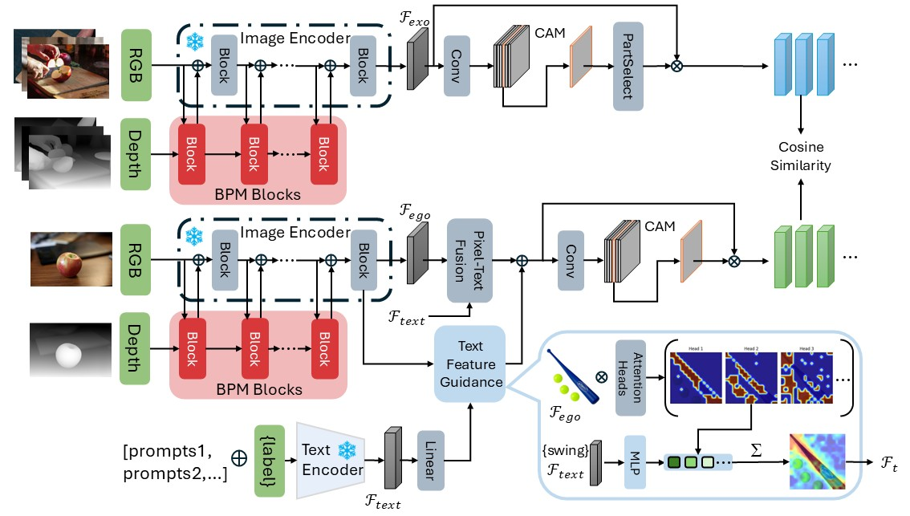

# Resource-Efficient Affordance Grounding with Complementary Depth and Semantic Prompts 
 

## Abstract 
Affordance refers to the functional properties that an agent perceives and utilizes from its environment, and is key perceptual information required for robots to perform actions. This information is rich and multimodal in nature. Existing multimodal affordance methods face limitations in extracting useful information, mainly due to simple structural designs, basic fusion methods, and large model parameters, making it difficult to meet the performance requirements for practical deployment. To address these issues, this paper proposes the BiT-Align image-depth-text affordance mapping framework. The framework includes a Bypass Prompt Module (BPM) and a Text Feature Guidance (TFG) attention selection mechanism. BPM integrates the auxiliary modality depth image directly as a prompt to the primary modality RGB image, embedding it into the primary modality encoder without introducing additional encoders. This reduces the model's parameter count and effectively improves functional region localization accuracy. The TFG mechanism guides the selection and enhancement of attention heads in the image encoder using textual features, improving the understanding of affordance characteristics. Experimental results demonstrate that the proposed method achieves significant performance improvements on public AGD20K and HICO-IIF datasets. On the AGD20K dataset, compared with the current state-of-the-art method, we achieve a 6.0% improvement in the KLD metric, while reducing model parameters by 88.8%, demonstrating practical application values.  

## Requirements 
We run in the following environment: 
- A NVIDIA GeForce RTX 3090
- python(3.12.4)
- torch(2.3.1)
- CUDA(11.8)

## Acknowledgements
We would like to express our solemn gratitude to the following for their excellent work for providing us with valuable inspiration or contributions: [LOCATE](https://github.com/Reagan1311/LOCATE), [CLIP](https://github.com/openai/CLIP), [DINO V2](https://github.com/facebookresearch/dinov2), [WSMA](https://github.com/xulingjing88/WSMA).
